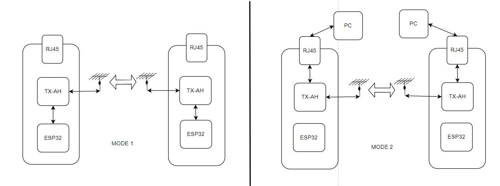
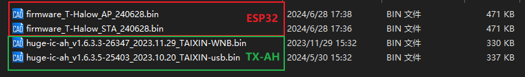

<h1 align = "center">🏆 T-Halow 🏆</h1>

 
  
  
  
  

* [切换到中文版](./README_CN.md)

❗❗❗ More TX-AH module information can be found on the official website，[download](https://en.taixin-semi.com/Product?prouctSubClass=33)；❗❗❗ 

T-Halow is WiFi Halow, an optimized Wi-Fi solution for iot devices, which has a longer transmission distance while providing the same transmission power of 2.4GHz and 5GHz. T-Halow is equipped with the TX-AH module, which can operate in the 730M-950MHz band, the module can operate in the channel width of 1/2/4/8MHz, and can provide a physical throughput of 150 Kbps to 32.5Mbps.

T-Halow operates in two modes:

Firmware download:
~~~
MODE1: Send AT command control to TX-AH via ESP32
    TX-AH: download huge-ic-ah_v1.6.3.5-25403_2023.10.20_TAIXIN-usb.bin
    ESP32: Download AP or STA

MODE2: Send AT command control via micro-USB
    TX-AH: download huge-ic-ah_v1.6.3.3-26347_2023.11.29_TAIXIN-WNB.bin
    ESP32: No firmware download required
~~~

## 1. TX-AH module firmware Download

1、Download firmware through the downloader，[click](./docs/Firmware_burn_1.md) ;

2、Download firmware via esp32，[click](./docs/Firmware_burn_1.md) ;

## 2. TX-AH model comparison

|        Module name       |     Front screen distinction     |    Overcertified condition     |                       remark                        |
| :----------------: | :------------: | :----------: | :---------------------------------------------: |
|    TX-AH-R900P     | Lower left P9, lower right P9  | Can pass FCC/CE certification |             Supports 860MHz to 928MHz             |
|   TX-AH-R900PNR    | Lower left P9, lower right NR |  Can pass FCC certification   | Support 902MHz ~ 928MHz, with 915M Saw to improve receiving performance |
| TX-AH-R900PNR-860M | Lower left 86, lower right NR |   Can pass CE certification   | Support 859MHz ~ 894MHz, with 875M Saw to improve reception performance |

remark:
1. The difference between the P series module and the earlier A series module is:

(1) The bottom left screen print of the P series is beginning with P, and the bottom left screen print of the A series is beginning with R;

(2) P series PIN4/5 needs power supply, A series does not;

2. The module does not have a Shield by default. The name of the module with a shield is suffix-s, where S indicates shield.

## 3. TX-AH documents

Official document;

More TX-AH module information can be found on the official website，[download](https://en.taixin-semi.com/Product?prouctSubClass=33)

|           Frequency setting description           | [docs](./hardware/TX_AH/泰芯802.11AH%20Frequency%20setting%20description_20231130110312.pdf)                       |
|:-------------------------------------------------:|:------------------------------------------------------------------------------------------------------------------ |
| TX-AH-Rx00P Series module technical specification | [docs](./hardware/TX_AH/泰芯802.11ah TX-AH-Rx00P%20Series%20module%20technical%20specification_20231116174457.pdf) |
|          TX-AH-Rx00P Bridge instructions          | [docs](./hardware/TX_AH//泰芯AH%20Bridge%20instructions_20230908122753.pdf)                                        |
|    AH Module AT instruction development guide     | [docs](./hardware/TX_AH/泰芯AH%20Module%20AT%20instruction%20development%20guide_20230524100503.pdf)               |
|     AH Module development board instructions      | [docs](./hardware/TX_AH/泰芯AH%20Module%20development%20board%20instructions_20230621205234.pdf)                   |
|          AH Module hardware Design Guide          | [docs](./hardware/TX_AH/泰芯AH%20Module%20hardware%20Design%20Guide_20230621170639.pdf)                            |
|            AH Performance test method             | [docs](./hardware/TX_AH/泰芯AH%20Performance%20test%20method_20230908122816.pdf)                                   |
|           AH-RF EMC Certification guide           | [docs](./hardware/TX_AH/泰芯AH-RF EMC%20Certification%20guide_20230720140052.pdf)                                  |

Other documents;

| T-Halow mode_1 test  |     |
| -------------------- | --- |
| T-Halow mode_2 test  |     |
| TX-AH module pairing |[docs](./docs/module_pair.md)|

