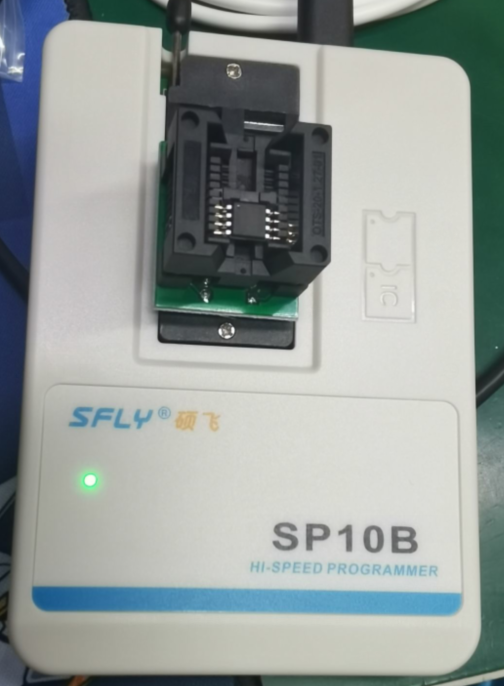
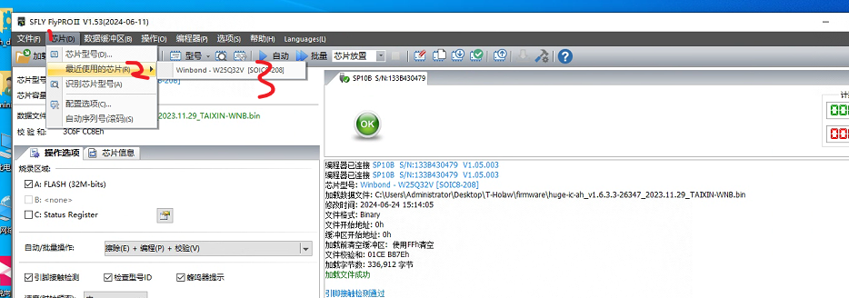
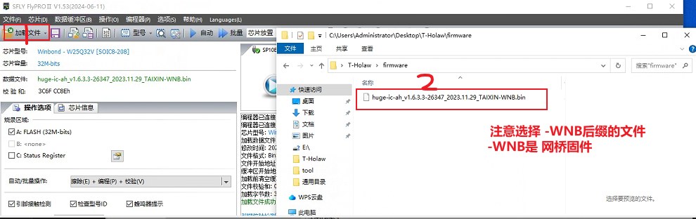
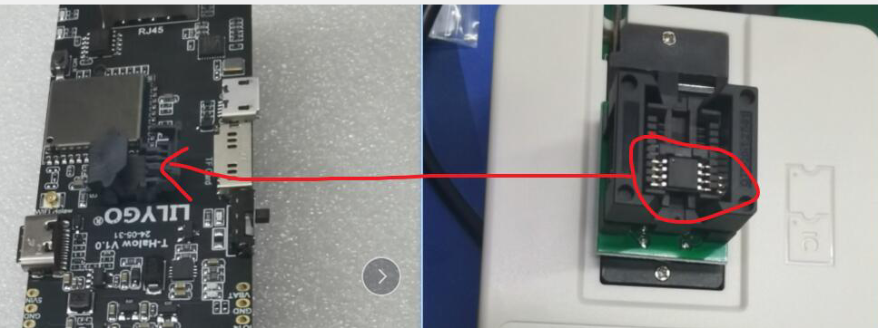
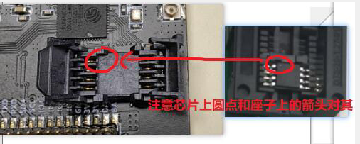
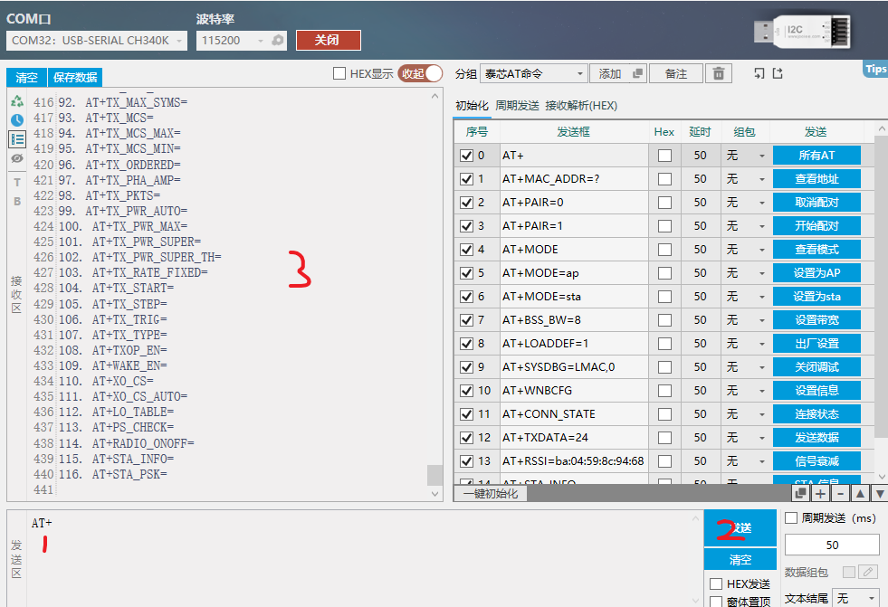
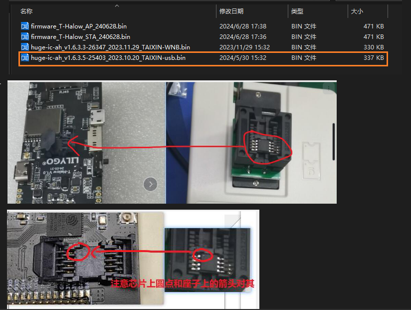
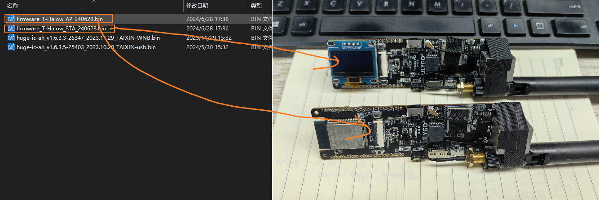
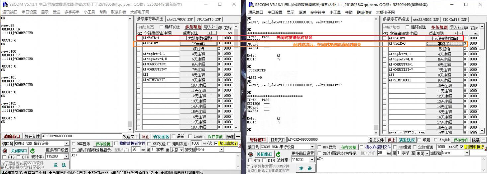
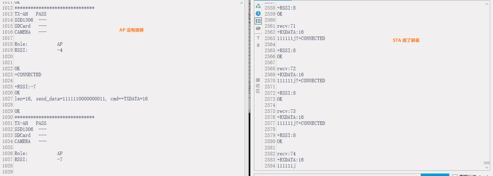

<h1 align = "center">🏆 T-Halow 🏆</h1>

 
  
  
  
  

* [切换到中文版](./README_CN.md)

❗❗❗ More TX-AH module information can be found on the official website，[download](https://en.taixin-semi.com/Product?prouctSubClass=33)；❗❗❗ 

T-Halow is WiFi Halow, an optimized Wi-Fi solution for iot devices, which has a longer transmission distance while providing the same transmission power of 2.4GHz and 5GHz. T-Halow is equipped with the TX-AH module, which can operate in the 730M-950MHz band, the module can operate in the channel width of 1/2/4/8MHz, and can provide a physical throughput of 150 Kbps to 32.5Mbps.

T-Halow operates in two modes:

Firmware download:
~~~
MODE1: Send AT command control to TX-AH via ESP32
    TX-AH: download huge-ic-ah_v1.6.3.5-25403_2023.10.20_TAIXIN-usb.bin
    ESP32: Download AP or STA

MODE2: Send AT command control via micro-USB
    TX-AH: download huge-ic-ah_v1.6.3.3-26347_2023.11.29_TAIXIN-WNB.bin
    ESP32: No firmware download required
~~~

## 1. TX-AH module test

❗❗❗ More TX-AH module information can be found on the official website，[download](https://en.taixin-semi.com/Product?prouctSubClass=33)；❗❗❗ 

### 1.1 TX-AH module test

The first time to use the module, you need to use the Flash burner to burn the firmware to Flash, here download `huge-ic-ah_v1.6.3.3-26347_2023.11.29_TAIXIN-WNB.bin` as an example.

Downloader using FLY SP10B, [software download address](https://www.sflytech.com/Download/Software/), Download software [FlyPRO Ⅱ](https://www.sflytech.com/html/3128973325.html), place the Flash chip as follows; Then connect the downloader to your computer;

Open FlyPRO II, click Chip -> Identify chip model -> Then select the corresponding Flash chip model;

Download bridge firmware `huge-ic-ah_v1.6.3.3-26347_2023.11.29_TAIXIN-WNB.bin` to Flash with downloader; After downloading, place the Flash chip on the T-Halow seat;

After the firmware download is complete, plug in Type-C and Micro-USB, and then use the serial port to open the COM port where the Micro-USB is located, and then send `AT+` to test whether the TX-AH firmware is downloaded successfully;

### 1.2 ESP32 and TX-AH test

Download usb firmware `huge-ic-ah_v1.6.3.5-25403_2023.10.20_TAIXIN-usb.bin` to Flash with downloader; After downloading, place the Flash chip on the T-Halow seat;

Then burn the firmware with the esp32 download tool; One board downloads AP firmware, and one board downloads STA firmware; When testing the communication distance outdoors, it is recommended to access the screen on the STA;

Then connect the board to the computer and send the pairing command; Click the first command at the same time, wait a while (about 3~5s), click the second command at the same time;

After the pairing is successful, the following content will be printed;

## 2. TX-AH model comparison

|        Module name       |     Front screen distinction     |    Overcertified condition     |                       remark                        |
| :----------------: | :------------: | :----------: | :---------------------------------------------: |
|    TX-AH-R900P     | Lower left P9, lower right P9  | Can pass FCC/CE certification |             Supports 860MHz to 928MHz             |
|   TX-AH-R900PNR    | Lower left P9, lower right NR |  Can pass FCC certification   | Support 902MHz ~ 928MHz, with 915M Saw to improve receiving performance |
| TX-AH-R900PNR-860M | Lower left 86, lower right NR |   Can pass CE certification   | Support 859MHz ~ 894MHz, with 875M Saw to improve reception performance |

remark:
1. The difference between the P series module and the earlier A series module is:

(1) The bottom left screen print of the P series is beginning with P, and the bottom left screen print of the A series is beginning with R;

(2) P series PIN4/5 needs power supply, A series does not;

2. The module does not have a Shield by default. The name of the module with a shield is suffix-s, where S indicates shield.

## 3. TX-AH pairing instructions

To pair two TX-AH-RX00Ps, follow the following steps:

1. Check the screen printing on the lower right corner of the module. 7P means 700M, 868 means 868M, and 9P means 900M. Only modules with the same transmission frequency can be successfully equipped.

2. Suppose to use two modules that have downloaded USB firmware 7P of the development board, connect the two modules to the serial port, use the `AT+MODE=ap` command to set one device to ap mode, and use the `AT+mode=sta` command to set the other device to sta mode

3. When pairing, the AP device and STA device need to use the `AT+PAIR=1` command `AT+PAIR=0` command to stop the pairing

4. Note: The print serial port of USB firmware is A10/A11, and the print serial port of other firmware is A12/A13