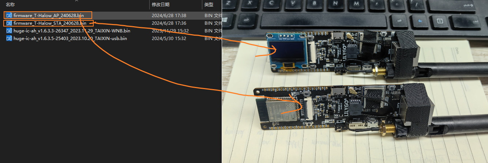
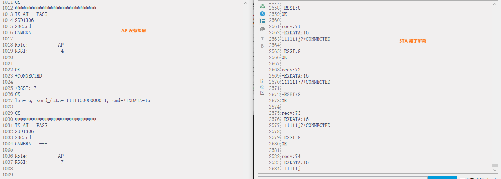

<h1 align = "center">🏆 T-Halow 🏆</h1>

 
  
  
  
  

* [Switch to English](./README.md)

❗❗❗ 更多 TX-AH 模块资料可参考官网，[资料下载地址](https://www.taixin-semi.com/Product?prouctSubClass=33)；❗❗❗

T-Halow 是作为物联网设备的优化 Wi-Fi 解决方案 WiFi Halow，在提供 2.4GHz、5GHz 相同的发射功率下有着更远的传输距离。T-Halow 搭载 TX-AH 模组，该模组可以工作在 730M-950MHz 频段，模组可工作的信道宽度为 1/2/4/8MHz，可提供 150 Kbps 到 32.5Mbps 的物理吞吐量。

T-Halow 的两种工作模式：

固件烧录：
~~~
MODE1：通过 ESP32  向 TX-AH 发送 AT 指令控制
    TX-AH：下载 huge-ic-ah_v1.6.3.5-25403_2023.10.20_TAIXIN-usb.bin
    ESP32：下载 AP 或 STA

MODE2：通过 micro-USB 发送 AT 指令控制
    TX-AH：下载 huge-ic-ah_v1.6.3.3-26347_2023.11.29_TAIXIN-WNB.bin
    ESP32：不用下载固件
~~~

## 1、TX-AH 模组测试

❗❗❗ 更多模块资料可参考官网，[资料下载地址](https://www.taixin-semi.com/Product?prouctSubClass=33)；❗❗❗

### 1.1 TX-AH 模组测试

第一次使用模组，需要用 Flash 烧录器将固件烧录到 Flash 中，这里下载 `huge-ic-ah_v1.6.3.3-26347_2023.11.29_TAIXIN-WNB.bin` 为例。

下载器使用的 硕飞SP10B，[软件下载地址](https://www.sflytech.com/Download/Software/)，下载软件 [FlyPRO Ⅱ](https://www.sflytech.com/html/3128973325.html)，将 Flash 芯片按如下放置；然后将下载器连接到电脑；

打开 FlyPRO Ⅱ，点击 芯片 -> 识别芯片型号 -> 然后选择对应的Flash芯片型号；

用下载器下载网桥固件 `huge-ic-ah_v1.6.3.3-26347_2023.11.29_TAIXIN-WNB.bin` 到 Flash 中；下载完成后，将 Flash 芯片放置到 T-Halow 座子上；

固件下载完成后，插上 Type-C 和 Micro-USB，然后使用串口打开 Micro-USB 所在的 COM 口，然后发送 `AT+` 测试 TX-AH 固件是否下载成功；

### 1.2、ESP32 与 TX-AH 测试
用下载器下载 usb固件 `huge-ic-ah_v1.6.3.5-25403_2023.10.20_TAIXIN-usb.bin` 到 Flash 中；下载完成后，将 Flash 芯片放置到 T-Halow 座子上；

然后用 esp32 下载工具烧录固件；一个板子下载 AP 固件，一个下载 STA 固件；在户外测试通信距离时，建议在 STA 上接入屏幕；

然后将板子连接电脑，发送配对命令；先同时点第一个命令，等一会(大概3~5s)，在同时点第二个命令；

配对成功后，会打印如下内容；

## 2、TX-AH 型号对比

|        模组名称        |     正面丝印区分     |    过认证情况     |                       备注                        |
| :----------------: | :------------: | :----------: | :---------------------------------------------: |
|    TX-AH-R900P     | 左下角 P9，右下角 P9  | 可过 FCC/CE 认证 |             支持 860MHz ~   928MHz             |
|   TX-AH-R900PNR    | 左下角 P9， 右下角 NR |  可过 FCC 认证   | 支持 902MHz ~  928MHz， 带 915M Saw   改善接收性能 |
| TX-AH-R900PNR-860M | 左下角 86， 右下角 NR |   可过 CE 认证   | 支持 859MHz ~   894MHz， 带 875M Saw   改善接收性能 |

备注：
1. P 系列模组与早期的 A 系列模组的区别是：

    （1） P 系列的左下角丝印是 P 开头， A 系列的左下角丝印是 R 开头；

    （2） P 系列的 PIN4/5 需要供电， A 系列不需要；

2. 模组默认不带屏蔽罩， 带屏蔽罩在上述模组名称带后缀-S，S 表示（Shield，屏蔽罩）。

## 3、TX-AH 配对说明

对两块泰芯 TX-AH-Rx00P 进行配对时，需要按照一下步骤：

1. 检查模组右下角的丝印，7P 表示 700M、868 表示 868M、9P 表示 900M，只有发射频率相同的模组才能配备成功；
2. 假设使用两块下载了开发板 USB 固件 7P 的模组，把两块模组接入到串口，使用 AT+MODE=ap 指令将一台设备设置为 ap 模式，使用 AT+mode=sta 指令将另一台设备设置为 sta 模式
3. 配对时，需要 AP 设备和 STA 设备同时使用 AT+PAIR=1 指令，配对成功后依次使用 AT+PAIR=0 指令停止配对
4. 注意：USB 固件的打印串口时 A10/A11，其他固件的打印串口是 A12/A13

