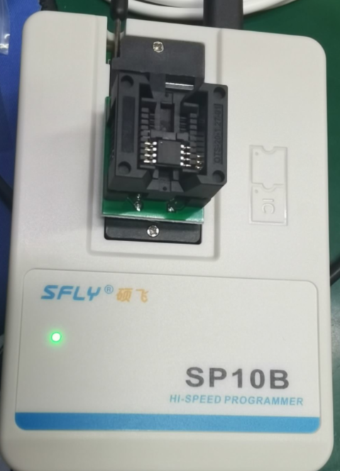
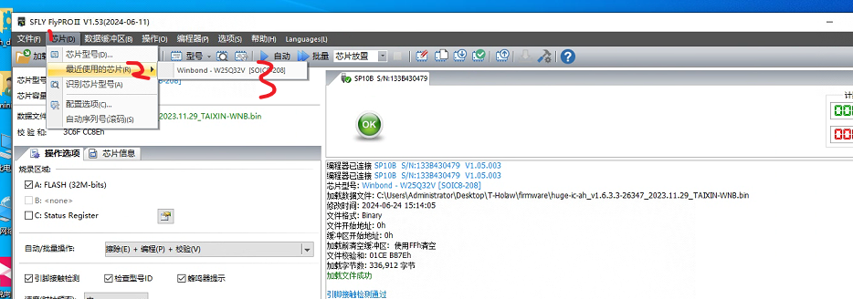
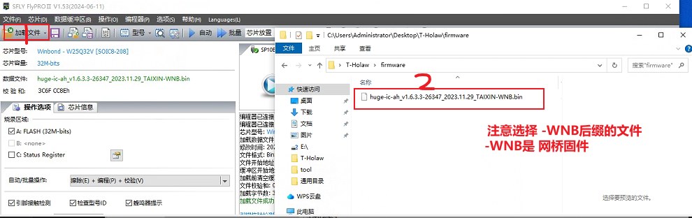
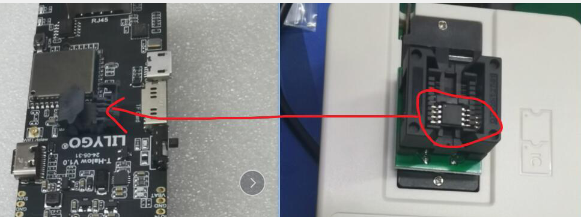
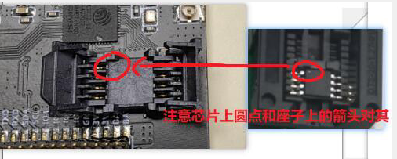
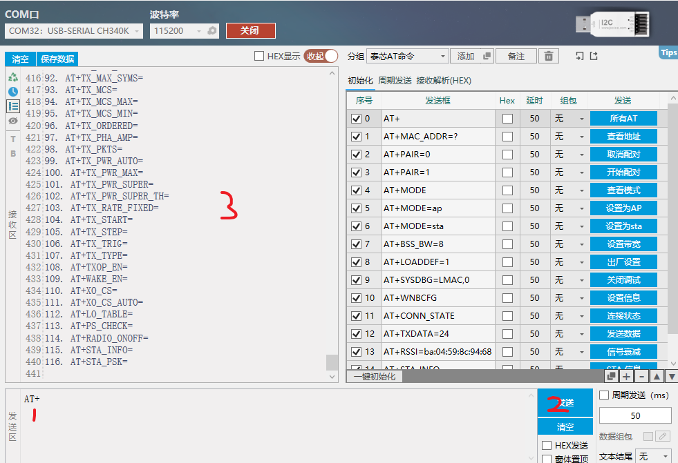

# Download using the downloader

Let's take FLY SP10B as an example;

1、Downloader using FLY SP10B, [software download address](https://www.sflytech.com/Download/Software/), Download software [FlyPRO Ⅱ](https://www.sflytech.com/html/3128973325.html), place the Flash chip as follows; Then connect the downloader to your computer;

2、Download the latest `hugc-ic-ah-xxxxxxxxxxxx.bin` firmware from [Github](https://github.com/Xinyuan-LilyGO/T-Halow/tree/master/firmware);

3、Open FlyPRO II, click Chip -> Identify chip model -> Then select the corresponding Flash chip model;

Download usb firmware `hugc-ic-ah-xxxxxxxxxxxx.bin` to Flash with downloader; After downloading, place the Flash chip on the T-Halow seat;

After the firmware download is complete, plug in Type-C and Micro-USB, and then use the serial port to open the COM port, and then send `AT+` to test whether the TX-AH firmware is downloaded successfully;

