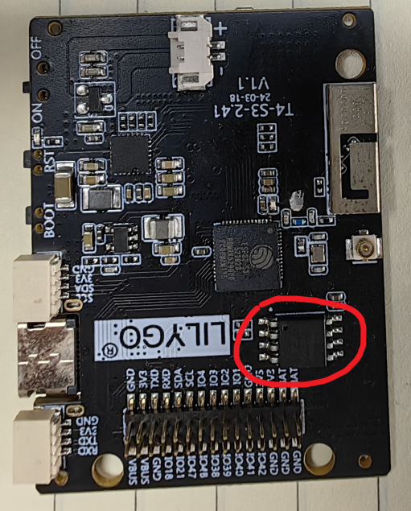
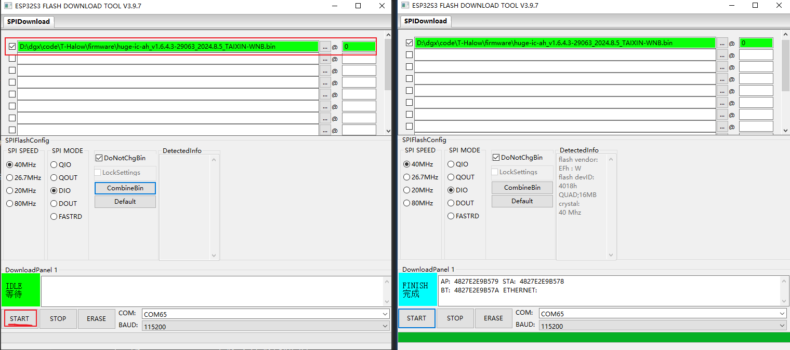
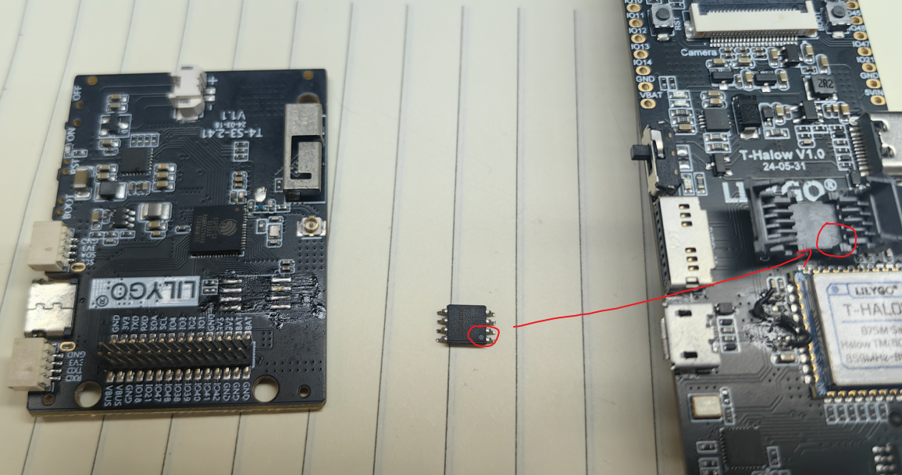

# Download firmware using esp32

1、Find a working esp32 board with flash encapsulated in SOP8

2、Use the [flash_download_tool](https://www.espressif.com/en/support/download/other-tools) download tool，Download firmware：[Firmware](https://github.com/Xinyuan-LilyGO/T-Halow/tree/master/firmware)

3、Then remove the flash from the esp32 board and put it into the seat of T-Halow; (Pay attention to clean up the flash chip to avoid T-Halow seat.)

