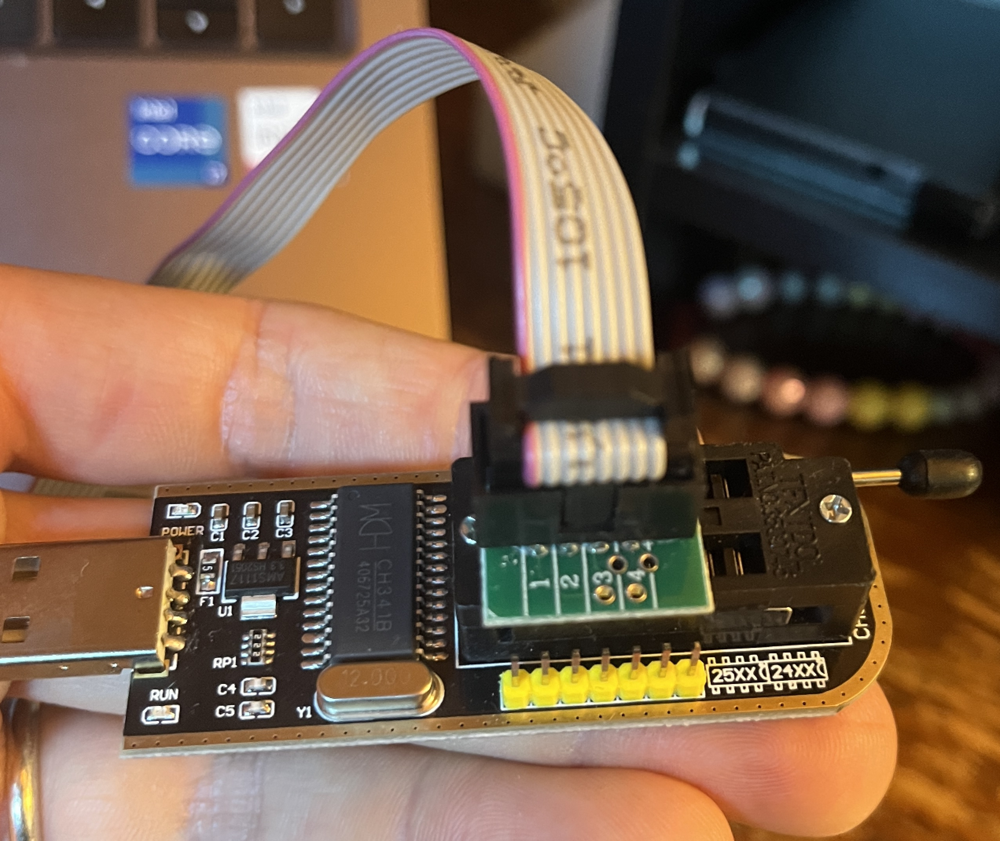
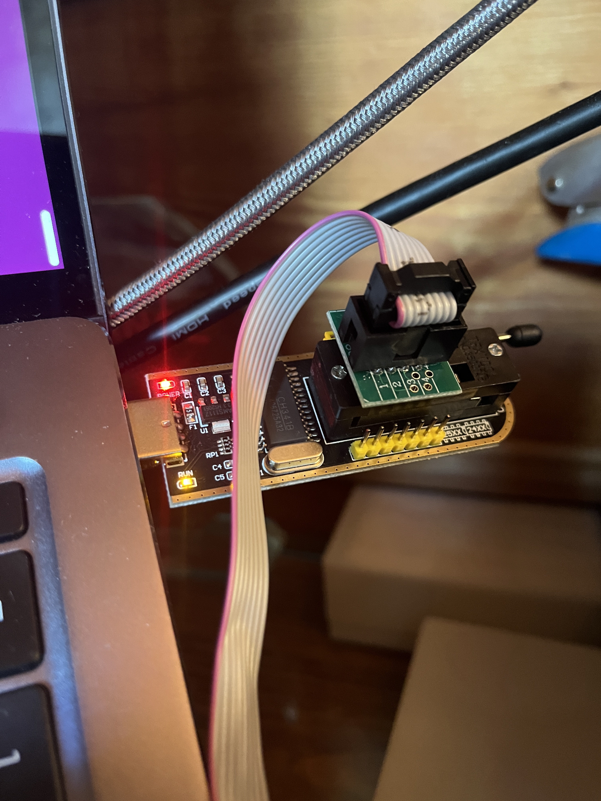
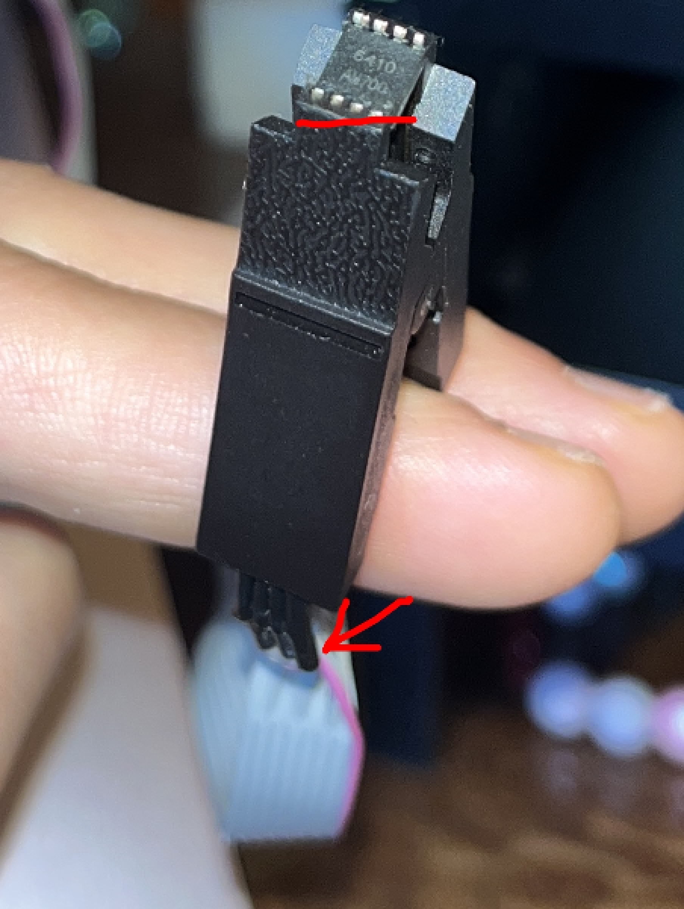
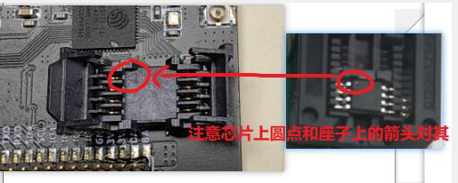

# Download Firmware via CH341A (Linux)

## Software Requirements

- [Flashrom](https://www.flashrom.org/Flashrom) - A mainstream utility for identifying, reading, writing, verifying, and erasing
  flash chips.
- Any Linux distribution (Ubuntu is used in this example)

## Hardware Requirements

- CH341A chip-based programmer
- SOIC8/SOP8 clip cable
- T-Halow board

### Steps

1. Ensure the jumper on the CH341A programmer is set to pin 1-2 for SPI mode.

2. Connect the SOIC8 clip to the CH341A programmer.



3. Connect the CH341A programmer to your computer via USB. Ensure both LEDs, the red and the yellow, are on.



4. Remove the flash from the T-Halow board and place it in the clip cable. You should be able to read the reference on
   the flash when the pink cable of the clip is pointing downward.



5. Install Flashrom if you haven't already. See <https://www.flashrom.org/release_notes/index.html>.

6. Run the following commands in a bash-compatible terminal (change the firmware path in variable ```FW```):
It makes two backup files before flashing the new firmware, `full-backup-1.bin` and `full-backup-2.bin`.

```bash
FW="huge-ic-ah-xxxxxxx.bin"  # Replace with your firmware file to flash

if [ ! -f "$FW" ]; then
  echo "Error: firmware file '$FW' not found"
  exit 1
fi

# 1. Check flashrom installed
if ! command -v flashrom >/dev/null 2>&1; then
  echo "Error: flashrom not found. Install with: sudo apt install flashrom"
  exit 1
fi

# 2. Check CH341 mode with lsusb
echo "[*] Checking CH341 programmer USB mode..."
if ! lsusb | grep -q "1a86:5512"; then
  echo "Error: CH341 not in SPI/I2C mode (ID 1a86:5512 not found)."
  echo " -> Make sure the MODE jumper on the CH341A Pro is on pins 1–2 (SPI/24/25 mode),"
  echo "    not on 2–3 (TTL/UART mode)."
  exit 1
fi
echo "[+] CH341 detected in SPI mode (1a86:5512)."

# 3. Probe programmer + chip
echo "[*] Probing CH341A and flash chip..."
if ! sudo flashrom -p ch341a_spi -V >/tmp/flashrom_probe.log 2>&1; then
  echo "Error: flashrom probe failed. See /tmp/flashrom_probe.log"
  exit 1
fi

if ! grep -q "W25Q32" /tmp/flashrom_probe.log; then
  echo "Error: Did not detect W25Q32 in probe log. Check clip orientation and contact."
  echo "See /tmp/flashrom_probe.log"
  exit 1
fi
echo "[+] Probe successful: W25Q32 detected."

# 4. Sanity check firmware size
FW_SIZE=$(wc -c <"$FW")
CHIP_SIZE=4194304
if [ "$FW_SIZE" -gt "$CHIP_SIZE" ]; then
  echo "Error: firmware size ($FW_SIZE) > chip size ($CHIP_SIZE)"
  exit 1
fi

# 5. Backup twice
echo "[*] Reading two full backups..."
sudo flashrom -p ch341a_spi -r full-backup-1.bin
sudo flashrom -p ch341a_spi -r full-backup-2.bin

if ! cmp -s full-backup-1.bin full-backup-2.bin; then
  echo "Error: backups differ! Check clip contact."
  exit 1
fi
echo "[+] Backups match."
sha256sum full-backup-*.bin

# 6. Merge firmware into backup at offset 0
echo "[*] Creating merged image..."
cp full-backup-1.bin merged.bin
dd if="$FW" of=merged.bin bs=1 seek=0 conv=notrunc status=progress
sync

MERGED_SIZE=$(wc -c <merged.bin)
if [ "$MERGED_SIZE" -ne "$CHIP_SIZE" ]; then
  echo "Error: merged.bin size mismatch ($MERGED_SIZE vs $CHIP_SIZE)"
  exit 1
```

7. Place the flash back into the T-Halow board socket.

