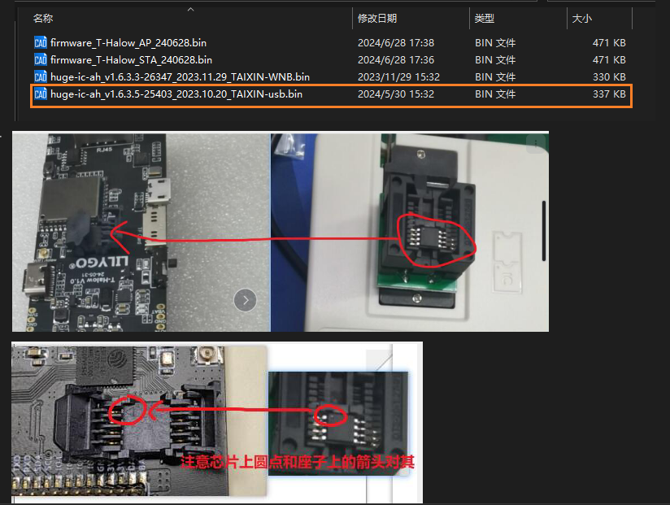
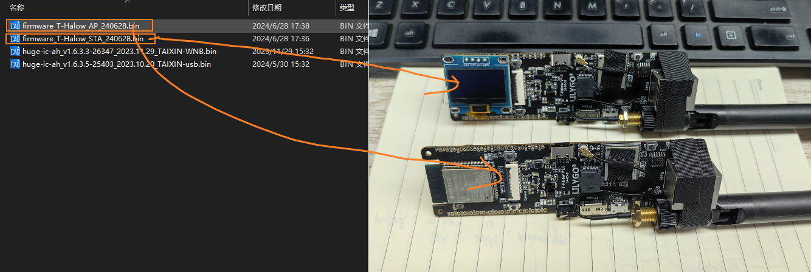
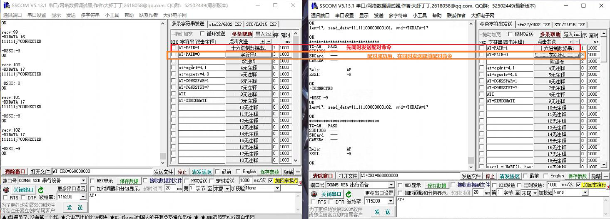
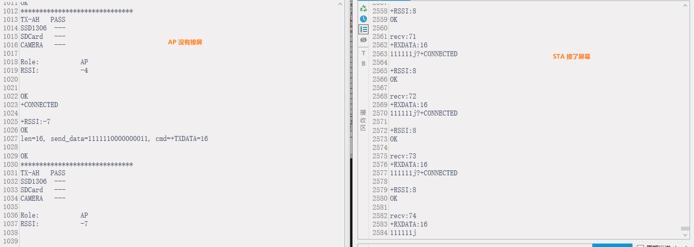

### 1.2 ESP32 and TX-AH test

Download usb firmware `huge-ic-ah_v1.6.3.5-25403_2023.10.20_TAIXIN-usb.bin` to Flash with downloader; After downloading, place the Flash chip on the T-Halow seat;

Then burn the firmware with the esp32 download tool; One board downloads AP firmware, and one board downloads STA firmware; When testing the communication distance outdoors, it is recommended to access the screen on the STA;

Then connect the board to the computer and send the pairing command; Click the first command at the same time, wait a while (about 3~5s), click the second command at the same time;

After the pairing is successful, the following content will be printed;

