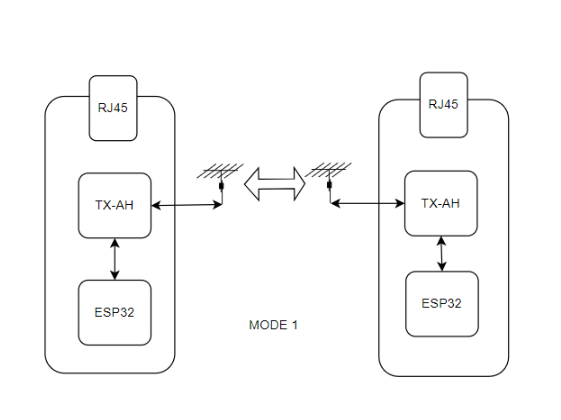
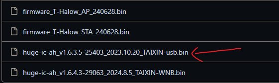
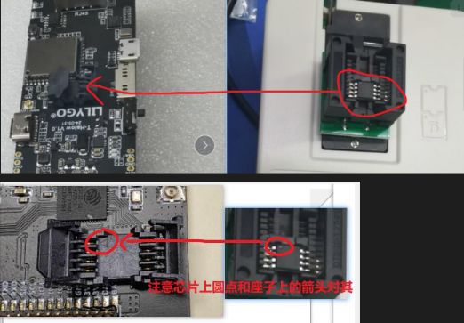
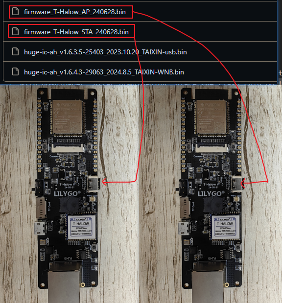
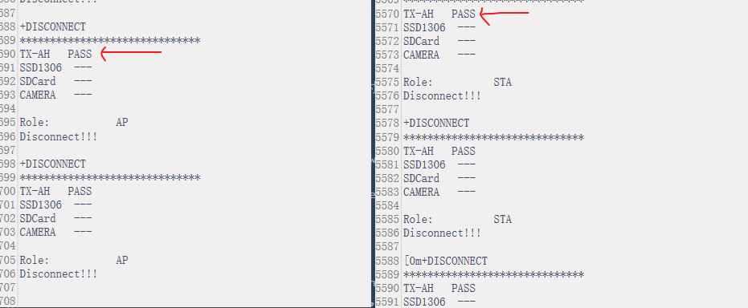

# Mode1: ESP32 and TX-AH test

Download usb firmware `huge-ic-ah_xxxxxxxxx_TAIXIN-usb.bin` to Flash, Note that the firmware ends in `-usb.bin`;

https://github.com/Xinyuan-LilyGO/T-Halow/tree/master/firmware

If Flash does not have the firmware, you can download firmware to Flash in either [Method 1](Firmware_burn_1.md) or [Method 2](Firmware_burn_2.md);

After downloading, place the Flash chip on the T-Halow seat;
Note the dot of the flash chip and the arrow on the T-Halow seat son against it;

If there are two T-Halow boards with the same frequency of TX-AH module, one can download the esp32 AP firmware and the other can download the esp32 STA firmware through Type-C download;

Plug the two boards into Type-C and open the serial port; The TX-AH module is successfully initialized;

During the initialization process, esp32 sends several AT instructions to TX-AH: `AT+SYSDBG=LMAC,0`, `AT+BSS_BW=8`, `AT+MODE=AP/STA`; [More AT](AT_cmd.md);

Start pairing, send pairing command; Send the `AT+PAIR=1` pairing command AT the same time. Wait for 3 to 5s. After the pairing succeeds, send the `AT+PAIR=0` command to cancel the pairing.

Print the test sending and receiving data after successful pairing;

