# Mode2: TX-AH network bridge

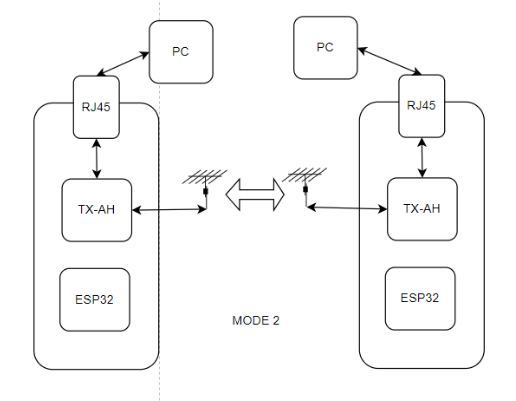

## 1. Network bridge firmware download

Download usb firmware `huge-ic-ah_xxxxxxxxx_TAIXIN-WNB.bin` to Flash, 
Note that the firmware ends in `-WNB.bin`;

https://github.com/Xinyuan-LilyGO/T-Halow/tree/master/firmware

After downloading, place the Flash chip on the T-Halow seat;

You can wire them as follows:
1. Type-C : Used to supply power to the device
2. Micro-usb: Connect the TX-AH module for debugging
3. RJ45: Connect your computer with an Internet cable

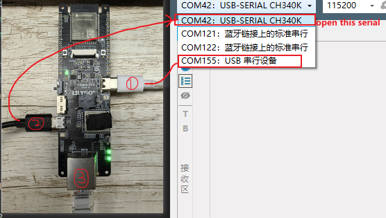

Then open the serial port of the Micro-usb (serial port suffix CH340); 
Send the [AT command](./AT_cmd.md) for configuration; 

## 2. Wireless network bridge function

### 2.1 Ethernet Settings

Prepare two T-halows to connect to the computer with a network cable. Configure wired network ip addresses for both computers.

Open `Control Panel \ Network and Internet\ Network and Sharing Center` Click Ethernet as shown below

Configure the IP address of the cable network. For example, set the IP address to `10.10.10.123` on one PC

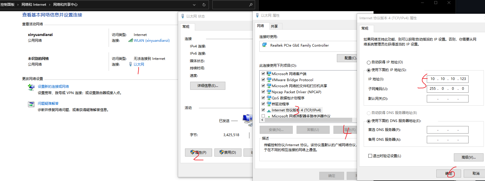

Set the IP address of the other PC to `10.10.10.156`

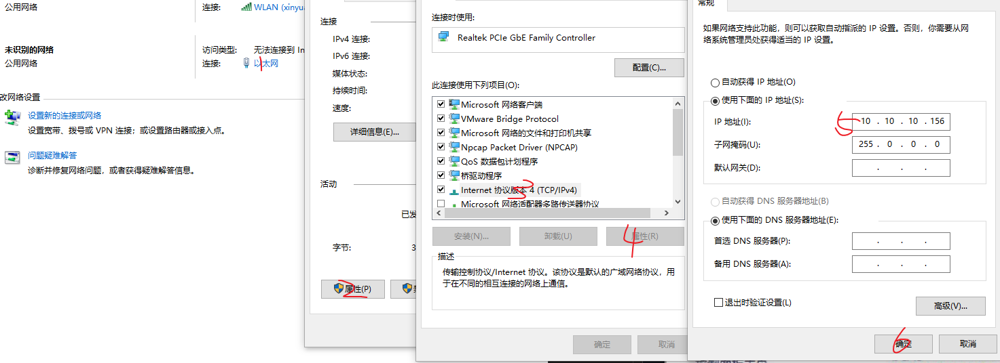

Disable the firewall temporarily

The following only describes the method of closing the firewall of windows. For the firewall of other security software, please find the method of closing:

1. `win+r` to bring up the running screen, enter cmd, and press Enter
2. In the cmd window that is displayed, enter `Firewall.cpl` and press Enter
3. In the firewall page that pops up, click "Enable or disable Windows Defender Firewall" options

In the pop-up "Custom Settings" page, select the "Turn off Windows Defender Firewall" option for all, and then click OK

### 2.2 The TX-AH module is paired

Open the serial port (with the CH340 symbol) of the Micro-usb;

Run the `AT+WNBCFG` command to view the configuration of the TX-AH module; Set one module to AP and the other to STA, `bss_bw` and `chan_list` are set to the same;

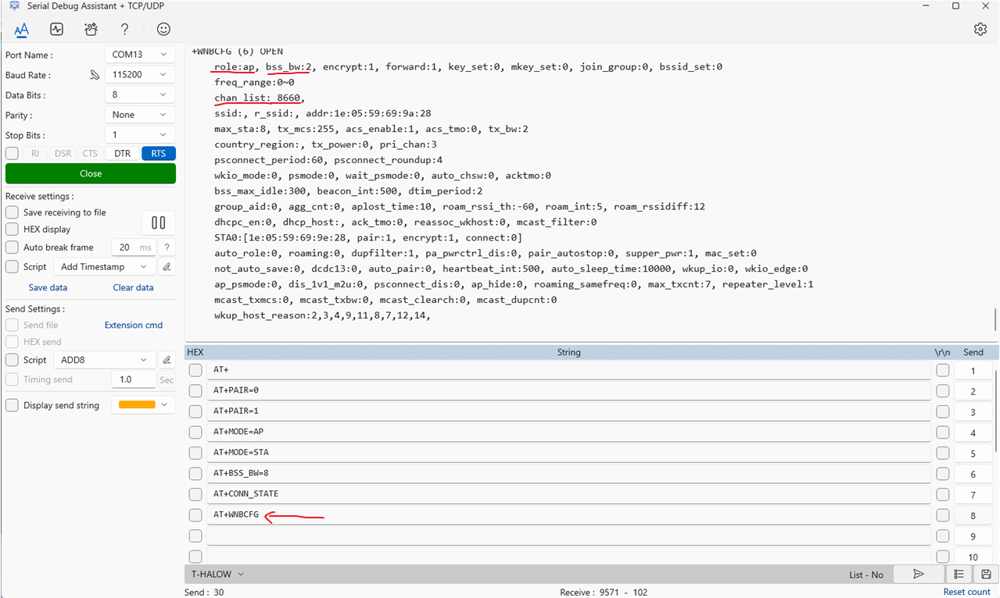

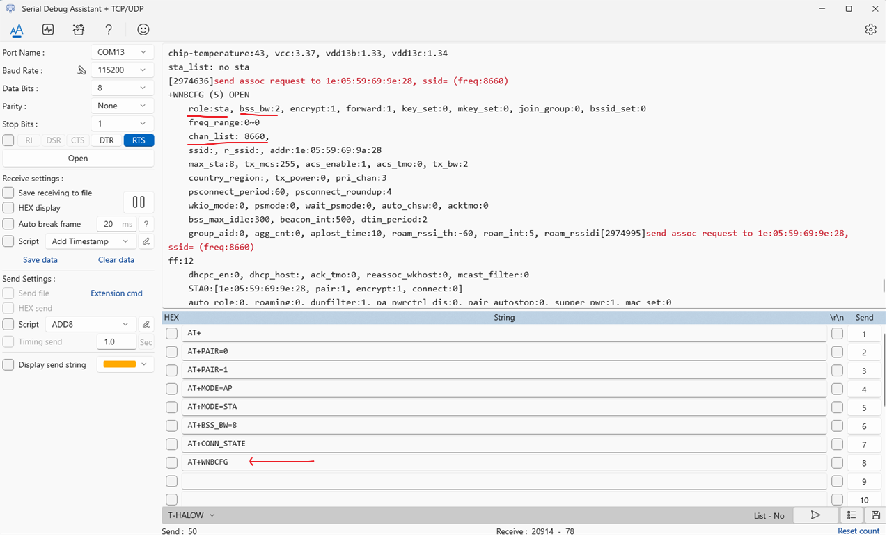

Start pairing, send pairing command; Send the `AT+PAIR=1` pairing command AT the same time. Wait for pairing success!;

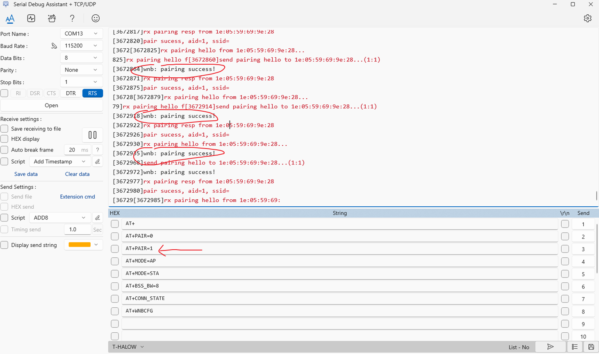

After the pairing succeeds, send the `AT+PAIR=0` command to cancel the pairing.

Then send the `AT+CONN_STATE` command to view, If "+CONNECTED" appears, the pairing is successful;

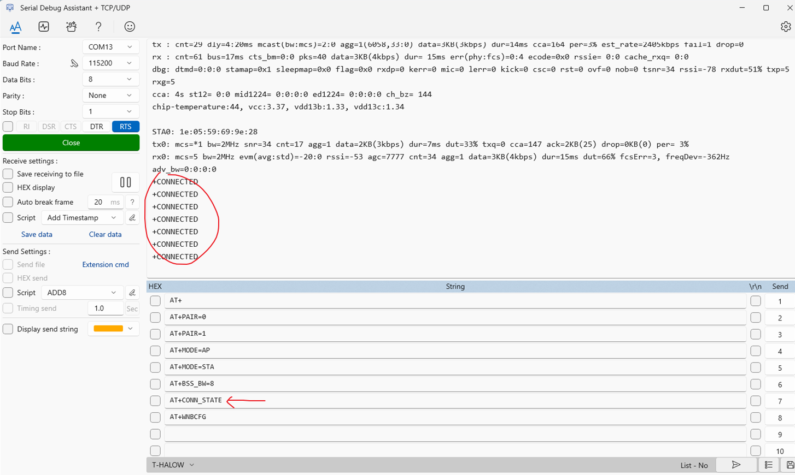

After the connection is successful, press `win+r`, enter `cmd` to develop the command line window, and then ping each other;

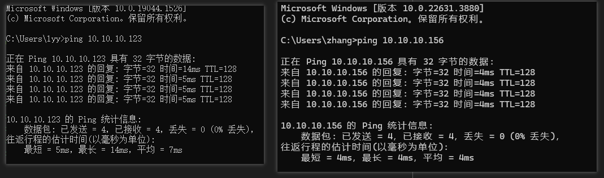

### 2.3 Send and receive data

Development of serial tools, a device set to server

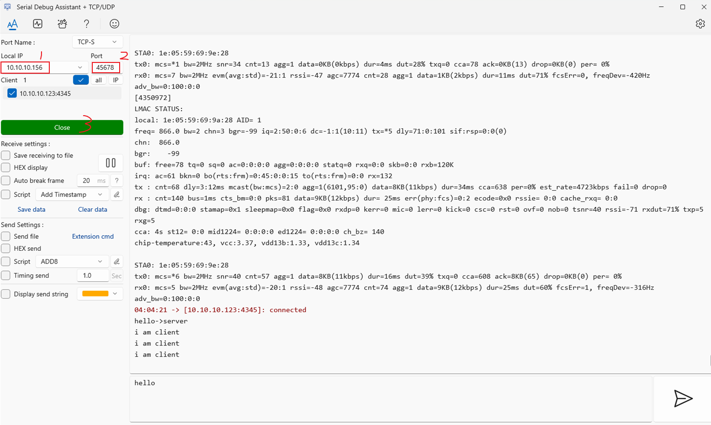

The other device is set to client

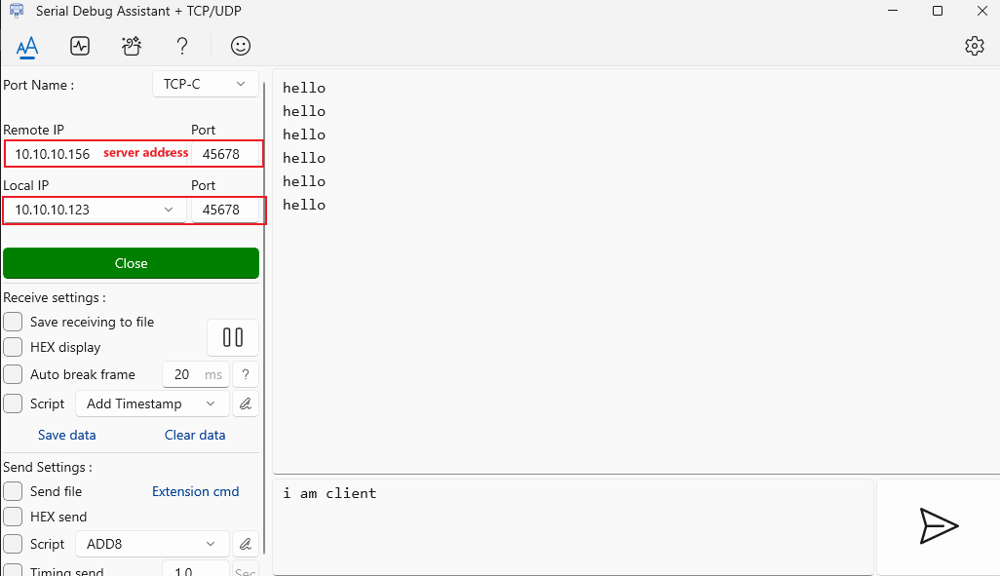