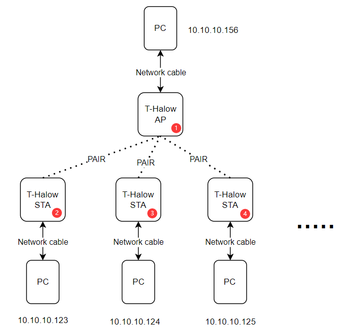
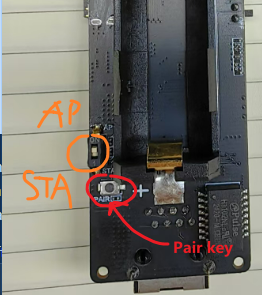
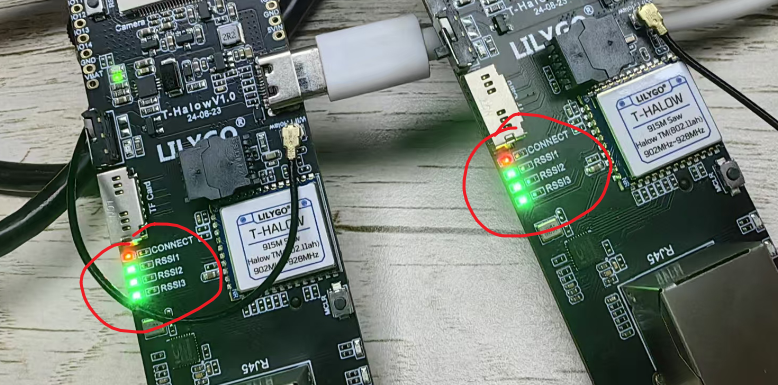
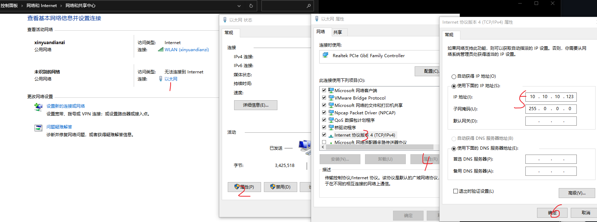
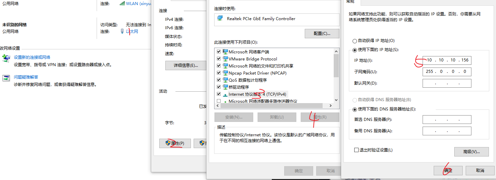
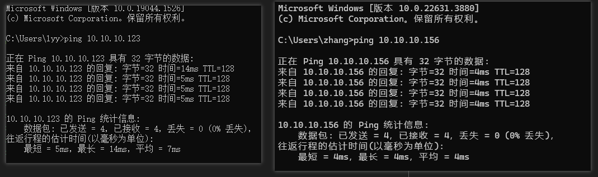
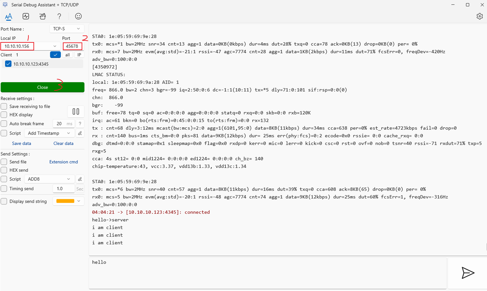
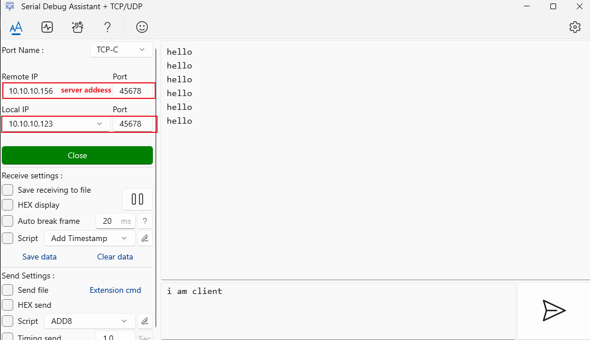

How to pair an AP with multiple STAs.

One AP connects to multiple STAs; **`by default, it supports up to 8 STAs`**

# ESP32

ESP32 downloads AT_test firmware, only serial port forwarding;

AT_test program path `example\AT_test.ino`

# PAIR

Before pairing, use the `AT+LOADDEF=1` command to reset each T-Halow to prevent them from automatically connecting to each other (If a T-Halow has been paired before, it will automatically pair when powered on again).

Use the latest T-Halow, turn the rear switch to AP/STA mode. In case of multiple T-Halows, only one needs to be set as AP and the others as STA.

First, long press the PAIR button of No.1 and No.2 until the CONNECT light flashes quickly, then release it. When the connection is successful, the CONNECT light will be on.

Then pair No.1 with No.3, also long press the PAIR button, the CONNECT light flashes quickly, and then release it. After the pairing is successful, the CONNECT light is always on.

The same operation is performed on the other STAs No.1 and No.N until all STAs are connected to the AP.

# CONFIG ADDR

Finally, assign an address to each T-Halow. Taking `10.10.10.156` and `10.10.10.123` as examples, set the address of T-Halow.

After all T-Halows are assigned addresses, they can ping each other to verify whether they can communicate.

Open `Control Panel \ Network and Internet\ Network and Sharing Center` Click Ethernet as shown below

Configure the IP address of the cable network. For example, set the IP address to `10.10.10.123` on one PC

Set the IP address of the other PC to `10.10.10.156`

Then turn off the PC's firewall and do not connect the PC to WIFI.

After the connection is successful, press `win+r`, enter `cmd` to develop the command line window, and then ping each other;

Development of serial tools, a device set to server

The other device is set to client

