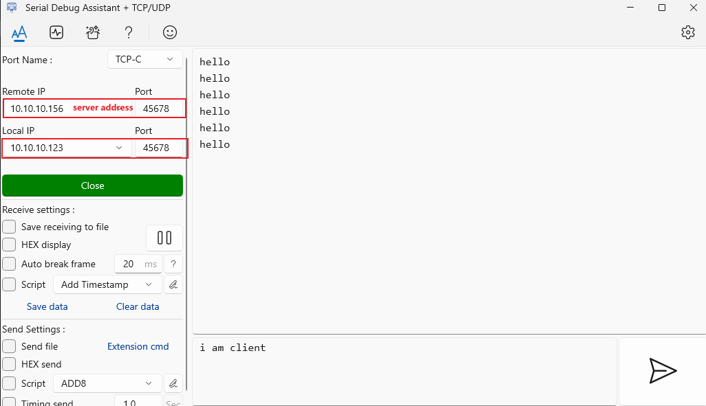

How to configure relay mode using T-Halow.

**`Currently only supports the first-level relay`**.

As shown in the figure below, this is true. the following describes how to configure these T-Halow

Before pairing, use the `AT+LOADDEF=1` command to reset each T-Halow to prevent them from automatically connecting to each other (If a T-Halow has been paired before, it will automatically pair when powered on again).

# ESP32

ESP32 downloads AT_test firmware, only serial port forwarding;

AT_test program path `example\AT_test.ino`

# PAIR
**1. AP**

Configure the AP's ssid. Each AP should have a different configuration. You can consider increasing it by ssid1 and ssid2. For example:
~~~
at+ssid=ssid1
~~~

Configure non-encryption (to simplify the configuration, temporarily use non-encryption as an example)

~~~
at+keymgmt=none
~~~

**2. APSTA**

Configuring the role of a relay

~~~
at+mode=apsta
~~~

Configure no encryption

~~~
at+keymgmt=none
~~~

Configure the relay's r_ssid, which is used to connect the relay to the AP. It should be consistent with the ssid of the AP you want to connect to, for example:

~~~
at+r_ssid=ssid1
~~~

Configure the relay's ssid to connect the relay to the sta. For ease of management, you can consider making the front ssid consistent with the ap's ssid and adding a suffix at the end, such as ssid1_r1, ssid1_r2, ssid2_r1, etc. For example:

~~~
at+ssid=ssid1_r1
~~~

**3. STA**

Configure the STA's ssid to connect to the relay. It should be consistent with the ssid of the relay you want to connect to, for example:

~~~
at+ssid=ssid1_r1
~~~

Configure no encryption

~~~
at+keymgmt=none
~~~

# CONFIG ADDR

Open `Control Panel \ Network and Internet\ Network and Sharing Center` Click Ethernet as shown below

Configure the IP address of the cable network. For example, set the IP address to `10.10.10.123` on one PC

Set the IP address of the other PC to `10.10.10.156`

Then turn off the PC's firewall and do not connect the PC to WIFI.

After the connection is successful, press `win+r`, enter `cmd` to develop the command line window, and then ping each other;

Development of serial tools, a device set to server

The other device is set to client

