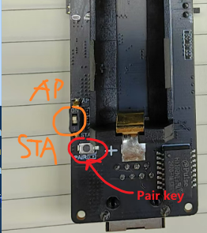

How to configure multiple T-Halows in relay mode.

The following figure shows an example of how to configure each T-Halow.

# ESP32

ESP32 downloads AT_test firmware, only serial port forwarding;

AT_test program path `example\AT_test.ino`

# PAIR

There are four T-Halow devices in total. Before pairing, use the `AT+LOADDEF=1` command to reset each T-Halow to prevent them from automatically connecting to each other (If a T-Halow has been paired before, it will automatically pair when powered on again).

After resetting each T-Halow using `AT+LOADDEF=1`, then connect No.1 and No.4 to the PC with an Ethernet cable, and No.2 and No.4 to each other with an Ethernet cable.

Set No.1 and No.3 to AP mode, and No.2 and No.4 to STA mode.

Use the latest T-Halow, turn the rear switch to AP/STA mode, and then restart the machine.

After confirming that the mode of each T-Halow is set correctly, use the PAIR key to pair them.

Press and hold the PAIR buttons No.1 and No.2 until the CONNECT light flashes, then release them. The same goes for numbers No.3 and No.4.

# CONFIG ADDR

Open `Control Panel \ Network and Internet\ Network and Sharing Center` Click Ethernet as shown below

Configure the IP address of the cable network. For example, set the IP address to `10.10.10.123` on one PC

Set the IP address of the other PC to `10.10.10.156`

Then turn off the PC's firewall and do not connect the PC to WIFI.

After the connection is successful, press `win+r`, enter `cmd` to develop the command line window, and then ping each other;

Development of serial tools, a device set to server

The other device is set to client

