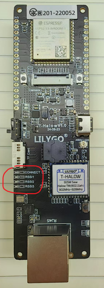
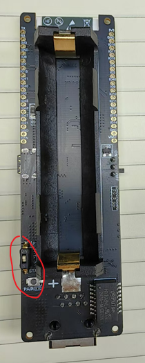

# T_Halwo Version1

|Added signal indicator| Add pairing and mode switching buttons |
|:---:|:---:|
|  |  |

# T-Halow networking mode:

The following networking modes are supported:

1. [Ap-STA](./network_mode/1_AP-STA.md) mode, basic star network, one AP connects multiple STAs; The maximum number of STAs supported can be configured by firmware, the default firmware supports a `maximum of 8 STAs`, and can be configured to support a maximum of 32 STAs (need to modify the firmware).

2. [AP-Relay-STA](./network_mode/2_AP-Relay-STA.md) mode, adding relay nodes to the basic star network to extend the distance, but the maximum flow will be halved; `Currently only supports the first-level relay`.

3. [AP-STA-net-AP-STA](./network_mode/3_AP-STA-net-SP-STA.md) mode, Extending communication distance via network cable.

4. Use [AT+ROAM](../AT_cmd.md##`AT+ROAM`) to enable roaming. The roaming function supports STA roaming between APs. STA will automatically select a stronger AP based on the signal conditions.

