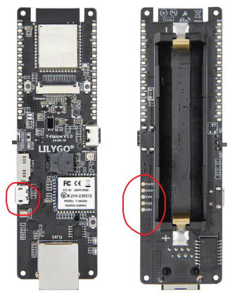
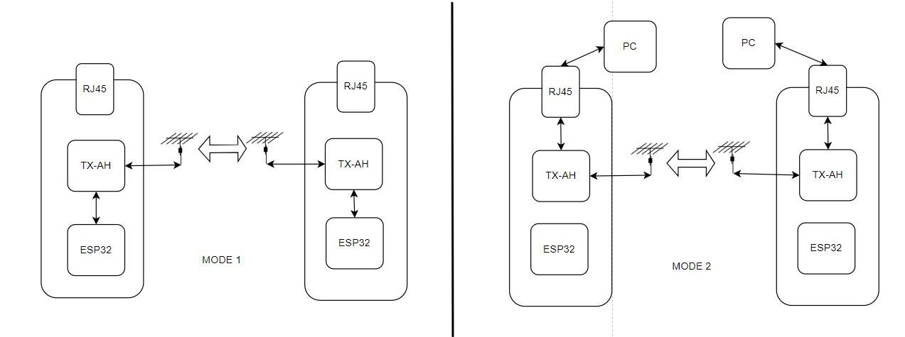
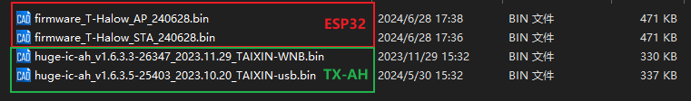
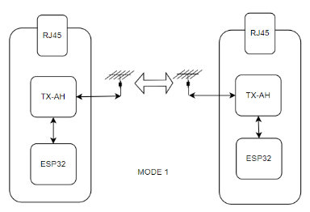
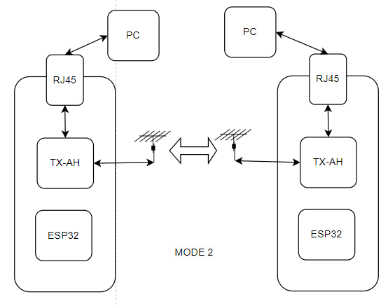

# T_Halwo Version2

T-Halow operates in two modes:

The two modes differ：

~~~
MODE1: Send AT command control to TX-AH via ESP32
    TX-AH: Download huge-ic-ah_xxxxxxxxx_TAIXIN-usb.bin
    ESP32: Download AP or STA
    Notice：Debug using Type-C

MODE2: Send AT command control via micro-USB
    TX-AH: download huge-ic-ah_xxxxxxxxx_TAIXIN-WNB.bin
    ESP32: No firmware download required
    Notice：Debug using Micro-USB
~~~

Firmware file path `firmware\version2`.

| T-Halow starts with MODE 1 | [docs](../mode1_test.md)  |  |
| -------------------------- | ----------------------------- | ------------------------ |
| T-Halow starts with MODE 2 | [docs](../mode2_test.md)  |  |
| TX-AH module pairing       | [docs](./module_pair.md) |      