This article is taken from: TX_AH\泰芯AH Bridge instructions_20230908122753.pdf

2.2 Flow test method

2.2.1 Preparing Tools

- Two windows PCS with cable network ports. (If no cable network port is available, switch from usb to cable network port.

Can also)

- Two network cables

- A pair of Thai core bridge (including host, antenna, 5v power supply) successfully paired according to the pairing method section.

- jperf(provided by contact FAE)

2.2.2 Traffic test method

2.2.2.1 The first step is to connect the computer to the network bridge using network cables

Connect a computer with a network cable to a bridge

Use a second cable to connect the other computer to the bridge

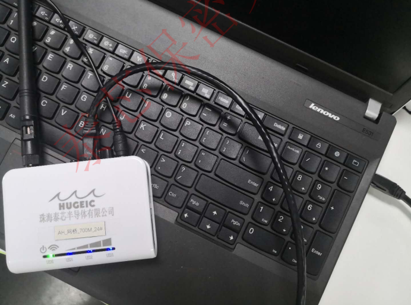

2.2.2.2 Step 2 Configure wired network ip addresses for the two computers

Open `Control Panel \ Network and Internet\ Network and Sharing Center` Click Ethernet as shown below

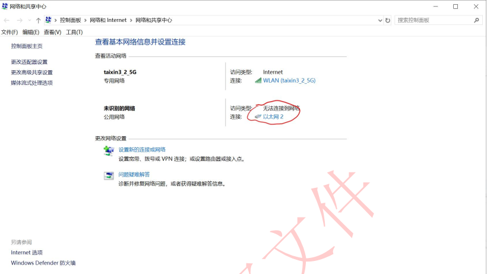

Click properties as shown below

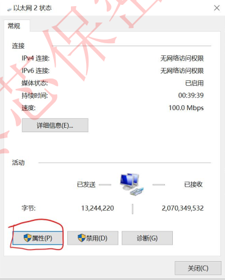

Click the internet Protocol version option and click Properties as shown below

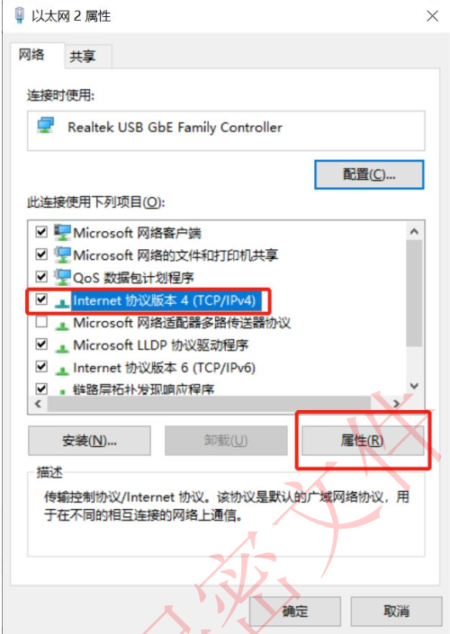

Configure the IP address of the cable network. For example, set the IP address to `10.10.10.156` on one PC and `10.10.10.123` on the other PC

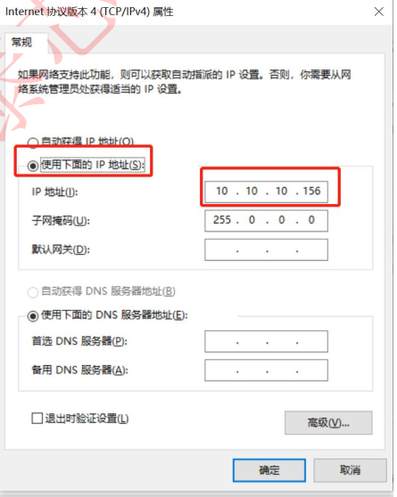

2.2.2.3 Step 3 Disable the firewall temporarily

If iperf is used as the traffic test method, disable the firewall; otherwise, the traffic test cannot be performed.

The following only describes the method of closing the firewall of windows. For the firewall of other security software, please find the method of closing:

1. `win+r` to bring up the running screen, enter cmd, and press Enter
2. In the cmd window that is displayed, enter `Firewall.cpl` and press Enter
3. In the firewall page that pops up, click "Enable or disable Windows Defender Firewall" options

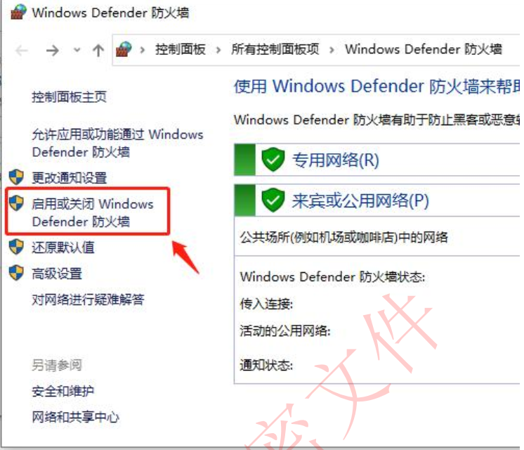

4. In the pop-up "Custom Settings" page, select the "Turn off Windows Defender Firewall" option for all, and then click OK

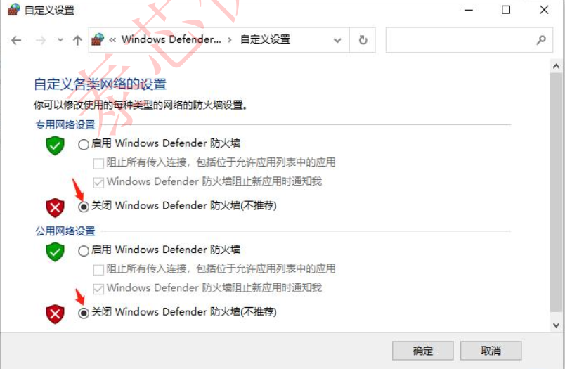

5. After the traffic test is complete, enable the firewall again on the page shown in Step 4.

2.2.2.4 Step 4 Run the jperf to send traffic

1.tcp test:

Run jperf on the first computer (ip address 10.10.10.156, bridge in ap mode). transport layer options Select tcp(tcp by default). Choose iperf mode :server, that is, as the server. Then click run iperf.

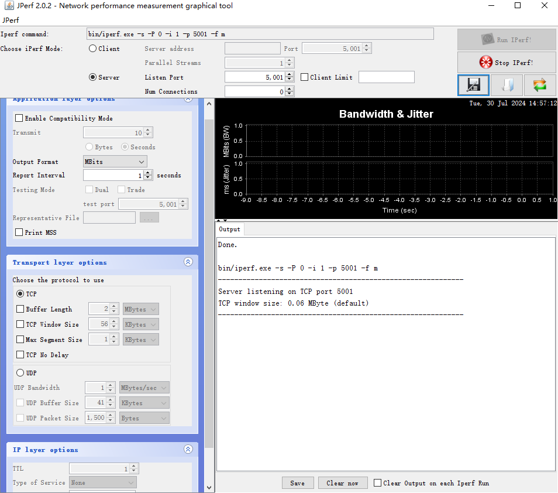

Run jperf on the second computer (ip address 10.10.10.123, bridge in sta mode). transport layer options Select tcp(tcp by default).

Choose iperf mode :client, that is, as the client. Server adress enters the ip address of the other computer, which is 10.10.10.156. Port 5001 is the default port number. The port number on the server and client must be the same.

You can change the traffic test duration (for example, 600 seconds) in the transmit item of the Application layer options. Set output format to a traffic unit, for example, Mbits. Then click run iperf.

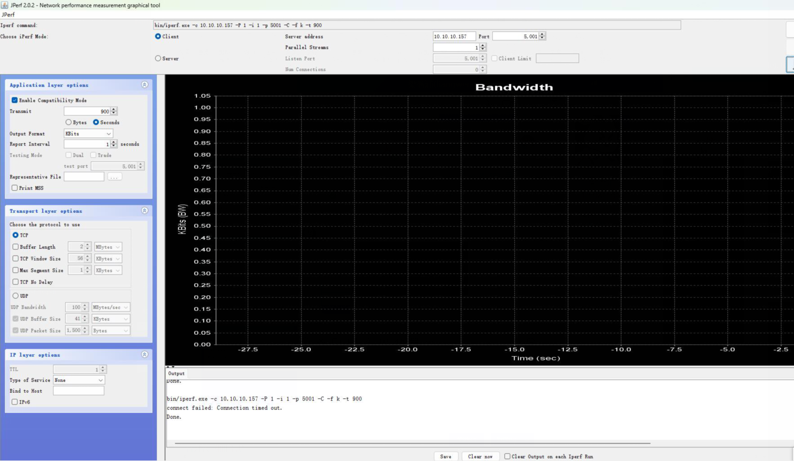

2.udp test

As with the tcp test, the first computer runs jperf and selects udp in the transport layer options.

Choose iperf mode :server, as the server, and click run iperf.

Run jperf on the second computer and select udp in transport layer options.

Choose iperf mode :client. That is, as the client, set udp bandwidth to

100 (default is 1). Server adress Enter the ip address of the other computer. Port 5001 is the default port number, the same for the server and the client, and then click run iperf. Observe the traffic data on the server.

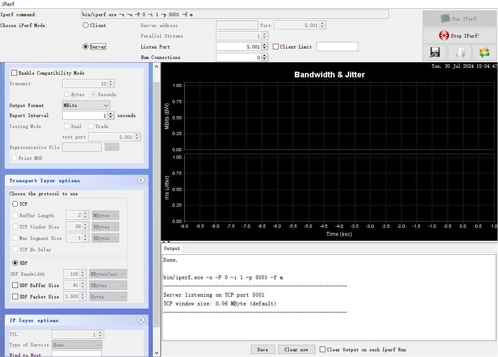

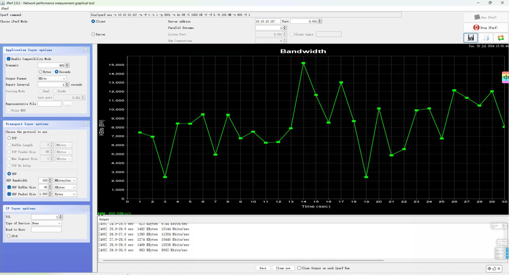

At present, the bridge design is sta to the ap direction of traffic priority, if the exchange of traffic direction to ap to sta direction, the traffic will be slightly smaller